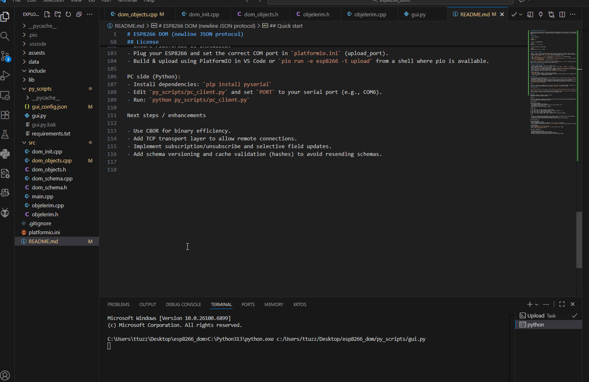

# ESP8266 DOM (newline JSON protocol)



Small firmware and PC-side GUI for a newline-delimited JSON object discovery / watch protocol. The firmware exposes schema-driven objects over Serial. The repository contains a lightweight runtime that maps C structs to schema-backed JSON objects.

## Quick start

- Build (PlatformIO):

```bash
platformio run
```

- Upload to a NodeMCU/ESP8266:

```bash
platformio run --target upload
```

- Open device monitor (serial 115200):

```bash
platformio device monitor -b 115200
```

## Where to add your objects

- Edit `src/objelerim.cpp` to add typed struct instances, their `FieldSchema[]`, and the `ObjSchema` entry.
- Keep only `extern` declarations in `src/objelerim.h` (already present). The runtime will register schemas from `dom_init()`.
- Example (already present): `laser` and `plasma` objects. To add another object:

1. Add a `typedef struct { ... } my_obj;` declaration to `src/dom_objects.h` or a dedicated header.
2. Add `extern my_obj my_instance;` to `src/objelerim.h`.
3. Define `my_obj my_instance = { ... };` and `static const FieldSchema myFields[] = { ... };` and `const ObjSchema mySchema = { ... };` in `src/objelerim.cpp`.
4. `dom_register_schema(mySchema)` is called on boot by `dom_init()`.

Notes: Use the `FieldSchema.addr` field to point at the absolute address of C++ `String` or primitive fields inside your instance. This avoids offset math and keeps things simple on MCUs.

## Protocol summary (newline JSON)

- discover: { "type":"discover", "id":"<id>", "path":"<name>" }
- discover.response: contains `found`, `schema` (with `fields`, `subscribable`, `readOnly`, `discoverable`)
- get: { "type":"get", "id":"<id>", "path":"<name>" }
- state: sent for `get` or immediate state responses; includes `_meta` with `subscriber_count` and schema hints
- subscribe / unsubscribe: supported; subscribe only allowed when schema has `discoverable==true` and `subscribable==true`
- set: { "type":"set", "id":"<id>", "path":"<name>", "changes": { ... } }
- update: emitted only when subscribers exist AND `subscribable==true` for that schema

Protocol invariants:
- `discoverable` controls whether a schema appears in discovery.
- `subscribable` controls whether subscribe is allowed and whether runtime unsolicited `update` messages are sent.
- `readOnly` prevents `set` operations on the object.

## Runtime notes

- The runtime stores schema definitions as pointers registered at boot. For safety, keep `ObjSchema` instances in a single translation unit (we use `objelerim.cpp`).
- The runtime is pointer-first: typed struct instances back the canonical object state. The JSON backing (`GenericObject`) is only created for schema-backed objects (no anonymous fallback objects are created for unknown paths).
- `dom_push_struct_to_json(name)` syncs a typed struct into the JSON runtime and emits an `update` only when subscribers exist and the schema is subscribable.

## GUI

- See `py_scripts/gui.py` (PySide6) and `py_scripts/gui_config.json` for client-side behavior. The GUI uses `discover` responses to enable/disable subscribe controls based on `subscribable`/`discoverable` flags.

## Troubleshooting

- If `subscribe` returns `not_subscribable`, check `objelerim.cpp` that the `ObjSchema` has the `subscribable` boolean set to `true`.
- If `get` returns `not_found`, the object has not been instantiated at runtime. `subscribe` will lazy-init schema-backed objects; otherwise create/push the struct values from your application code.

## License

Unlicensed / personal toy project. Adapt as you like.
ESP8266 DOM-like Object Discovery Protocol

Overview

This project demonstrates a simple object-based discovery and live-watch protocol between an ESP8266 device and a PC client using newline-delimited JSON messages over Serial.

Protocol basics

Message envelope (JSON):
- id: optional client-generated message id
- type: message type (discover, discover.response, get, state, update, error)
- path: object name (e.g., "laser")
- payload fields: schema, value, changes, message

Example flow

1) PC -> ESP: {"id":"1","type":"discover","path":"laser"}
2) ESP -> PC: {"id":"1","type":"discover.response","found":true,"schema":{...}}
3) PC -> ESP: {"id":"2","type":"get","path":"laser"}
4) ESP -> PC: {"id":"2","type":"state","path":"laser","value":{...}}
5) ESP -> PC: {"type":"update","path":"laser","changes":{...}}  // unsolicited updates

Files

- src/main.cpp: ESP8266 sketch implementing a tiny in-memory registry and JSON/NL protocol. Uses ArduinoJson.
- platformio.ini: PlatformIO config; added ArduinoJson as lib_deps.
- py_scripts/pc_client.py: Simple Python client using pyserial to discover and watch objects.

How to build and run

ESP side (PlatformIO):
- Ensure PlatformIO is installed.
- Plug your ESP8266 and set the correct COM port in `platformio.ini` (upload_port).
- Build & upload using PlatformIO in VS Code or `pio run -e esp8266 -t upload` from a shell where pio is available.

PC side (Python):
- Install dependencies: `pip install pyserial`
- Edit `py_scripts/pc_client.py` and set `PORT` to your serial port (e.g., COM6).
- Run: `python py_scripts/pc_client.py`

Next steps / enhancements

- Use CBOR for binary efficiency.
- Add TCP transport layer to allow remote connections.
- Implement subscription/unsubscribe and selective field updates.
- Add schema versioning and cache validation (hashes) to avoid resending schemas.

